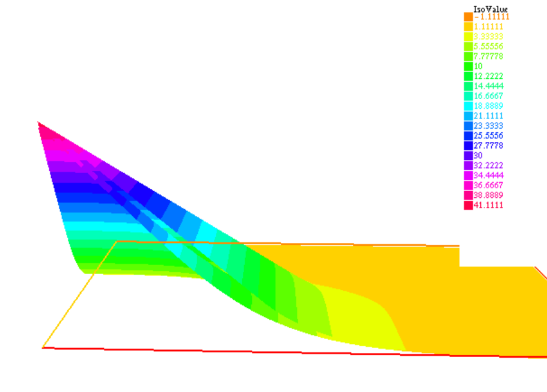
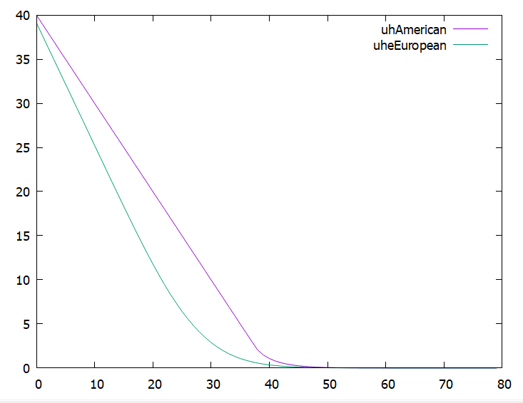
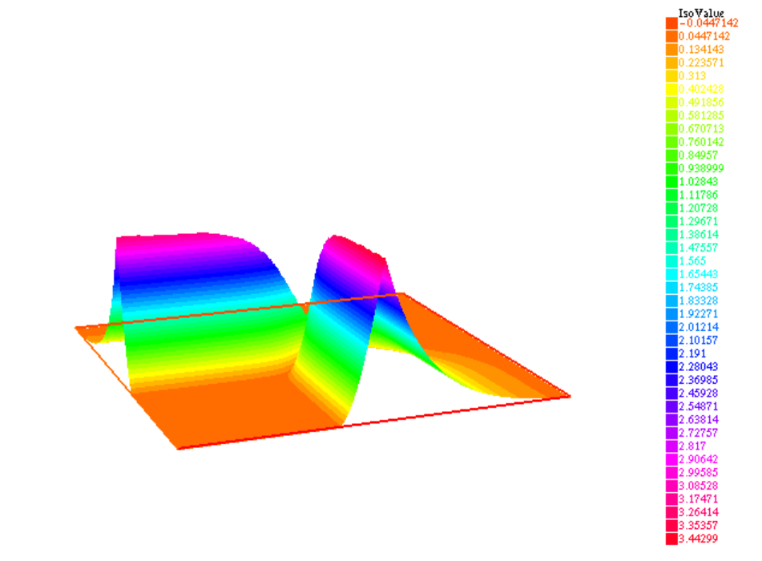
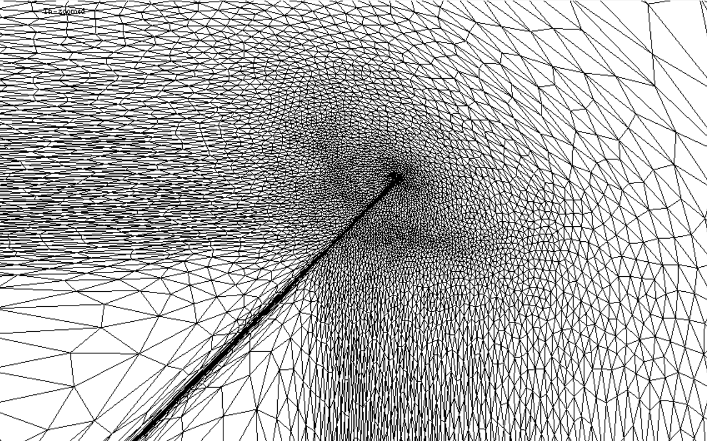

# American Basket Option Pricing with Finite Elements

This project implements a **FreeFEM++** solution for pricing **American basket options** using **finite element methods**. Developed as part of the **Applied Numerical Finance** course at **Bocconi University** under the supervision of **Professor Battauz**, this model focuses on pricing American options on the maximum of two assets and compares them with their European counterparts.

## Key Features

* **American Basket Option Pricing:** Computes the price of an American option on the maximum of two assets
* **Early Exercise Premium:** Calculates the premium associated with the early exercise feature by comparing the American option price with its European equivalent
* **Finite Element Method (FEM):** Leverages the power and flexibility of FreeFEM++, a dedicated PDE solver using FEM, to address the pricing problem
* **Adaptive Mesh Refinement:** Employs adaptive mesh refinement to enhance computational efficiency and accuracy, particularly in critical regions such as the exercise boundary

## Prerequisites

* **FreeFEM++:** Download and install the latest version of FreeFEM++ from the [official website](https://doc.freefem.org/introduction/download.html)

## Installation

1. **Install FreeFEM++:** Follow the instructions on the FreeFEM++ website to install the software for your operating system.

2. **Download the Project:**
   * Visit the project's GitHub repository
   * Click the green "Code" button
   * Select "Download ZIP" from the dropdown menu
   * Extract the downloaded ZIP file to your preferred location

3. **Run the Program:**

   **For Windows Users:**
   * Launch FreeFEM++ from the Start menu
   * Click on File → Open
   * Navigate to the extracted project folder
   * Select the `VIA-american_r2.edp` file
   * Click "Run" or press F5 to execute the script

   **For Linux/Mac Users:**
   * Open a terminal
   * Navigate to the extracted project folder:
     ```bash
     cd american-basket-options-freefem-main
     ```
   * Run the script using:
     ```bash
     FreeFem++ VIA-american_r2.edp 
     ```
## Usage

Before running the script, you can modify various parameters by editing the `VIA-american_r2.edp` file using any text editor (like Notepad++, VS Code, or even Windows Notepad). Look for the parameters section at the beginning of the file.

The FreeFEM++ script supports two operational modes controlled by the `COMPAREMODE` parameter, which you can toggle between `true` and `false` in the file:

### Comparison Mode (`COMPAREMODE = true`)
- Computes both American and European basket options
- Provides visual comparison between American and European options
- Calculates and visualizes the early exercise premium
- Generates comparison data files for external plotting
- Saves mesh data for both option types

### Standard Mode (`COMPAREMODE = false`)
- Focuses solely on American basket option pricing
- Provides visualization of the time value and mesh
- Generates standard plots and mesh data files

### Configuration Parameters

All the following parameters can be modified in the `VIA-american_r2.edp` file:

#### Algorithm Parameters
* `m`: Mesh size parameter (default: 40)
* `L`: Domain size in x direction (default: 80)
* `LL`: Domain size in y direction (default: 80)
* `kmax`: Maximum number of iterations for internal cycle (default: 7)

#### Financial Parameters
* `COMPAREMODE`: Boolean switch for comparison mode (true/false)
* `T`: Time to maturity in years (default: 1)
* `sigmax`: Volatility of first asset (default: 0.35)
* `sigmay`: Volatility of second asset (default: 0.3)
* `rho`: Correlation between assets (default: -0.3)
* `r`: Risk-free interest rate (default: 0.02)
* `K`: Strike price (default: 40)
* `dt`: Time step for numerical solution (default: 0.01)

#### Error Control Parameters
* `eps`: Convergence tolerance (default: 1e-10)
* `tol`: Mesh adaptation tolerance (default: 0.0005)
* `tolmin`: Minimum mesh adaptation tolerance (default: 0.0001)
* `tgv`: Penalization parameter (default: 1e30)
* `c`: Algorithm parameter (default: 1000)
* `kj`: Mesh adaptation frequency (default: 2)

**Note**: 
- After modifying any parameters, save the file before running it in FreeFEM++
- The mesh and numerical parameters are optimized for the default financial parameters. If you modify the financial parameters significantly, you may need to adjust the mesh and error control parameters accordingly
### Output Files

The script generates different output files based on the selected mode:

#### Comparison Mode
- `mm-VIA-american.points`: Mesh points for American option
- `mm-VIA-european.points`: Mesh points for European option
- `graphTime value of the option 3D.txt`: 3D plot data
- `plotCOMPAREamerican-european.txt`: Comparison data for text analysis

#### Standard Mode
- `mm-VIA-american.points`: Mesh points for American option
- `plotVIA-american.gp`: Gnuplot data file
- Various .eps plot files

## Results

The script produces the computed American basket option price. FreeFEM++ also generates visualizations of the solution. The early exercise premium is calculated by comparing American and European option prices. Adaptive mesh refinement ensures higher accuracy in critical regions, such as near the strike price.

<div align="center">
    
</div>
<div align="center">
    <strong>Figure 3a - Price American vs European</strong>
</div>
<hr style="border: 0.25px solid #ddd; width: 70%;">
<div align="center">
    
</div>
<div align="center">
    <strong>Figure 3b - American vs European diagonal section</strong>
</div>
<hr style="border: 0.25px solid #ddd; width: 70%;">
<div align="center">
    
</div>
<div align="center">
    <strong>Figure 4 - Early Exercise Premium</strong>
</div>
<hr style="border: 0.25px solid #ddd; width: 70%;">
<div align="center">
    
</div>
<div align="center">
    <strong>Figure 5 - Time value</strong>
</div>
<hr style="border: 0.25px solid #ddd; width: 70%;">
<div align="center">
    
</div>
<div align="center">
    <strong>Figure 6a - Mesh 2d</strong>
</div>
<hr style="border: 0.25px solid #ddd; width: 70%;">
<div align="center">
    
</div>
<div align="center">
    <strong>Figure 6b - Mesh on time value</strong>
</div>


## Technical Documentation

For detailed information about the mathematical formulation, numerical methods, and implementation details, please refer to the [Technical Documentation](docs/Finite_Element_Methods_for_Option_Pricing.pdf).

## License

This project is licensed under the MIT License - see the [LICENSE](LICENSE) file for details.

## Contributing

Contributions are welcome! Please feel free to submit a Pull Request. For major changes, please open an issue first to discuss what you would like to change.

1. Fork the repository
2. Create your feature branch (`git checkout -b feature/AmazingFeature`)
3. Commit your changes (`git commit -m 'Add some AmazingFeature'`)
4. Push to the branch (`git push origin feature/AmazingFeature`)
5. Open a Pull Request

## Acknowledgments

* Professor Battauz for guidance and support during the Applied Numerical Finance course at Bocconi University
* The FreeFEM++ development team for providing this powerful and versatile PDE solver
* Contributors and researchers in the field of computational finance who have laid the groundwork for this implementation

## Contact Information

* **Author:** [Andrea Cesari]
* **Email:** [cesari.andrea.99@gmail.com]
* **LinkedIn:** [Your LinkedIn Profile]
* **Project Link:** [https://github.com/A-Cesari-Fin/american-basket-options-freefem](https://github.com/A-Cesari-Fin/american-basket-options-freefem)

## Citation

If you use this code in your research, please cite:
```bibtex
@misc{american-basket-options-freefem,
  author = {[Andrea Cesari]},
  title = {American Basket Option Pricing with Finite Elements},
  year = {2024},
  publisher = {GitHub},
  journal = {GitHub repository},
  url = {https://github.com/A-Cesari-Fin/american-basket-options-freefem}
}
```
